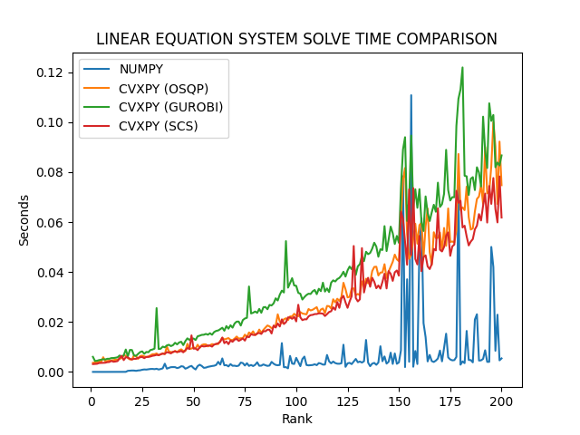

# Linear Equation System Time Comparison

Time measurements comparisons between cvxpy and numpy solving the same random linear equation systems, ranging in rank from 1 to 100.  
We were asked to find out which library does it faster, and it looks like numpy takes the cake!  
Just for fun I also compared cvxpy using different solvers.
